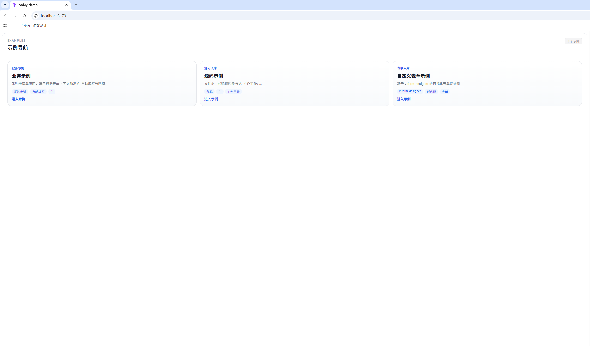
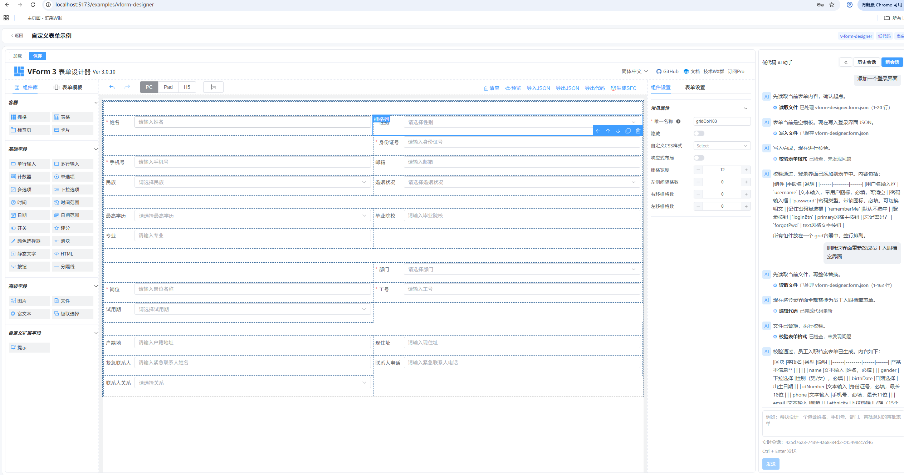
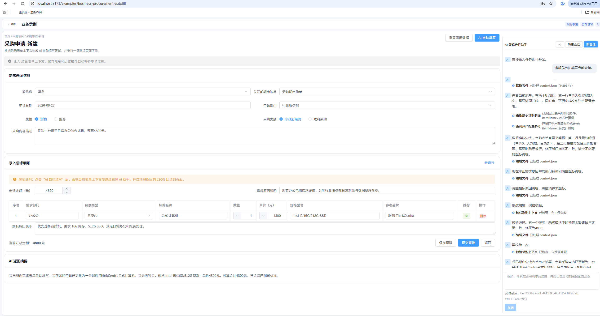

# Codey

Codey 是一个面向低代码平台和传统项目的 AI 编程与业务协作平台。

它重点解决两类问题：

1. 低代码平台通常无法直接接入市面上的 AI 编程工具，导致页面、表单、业务对象与 AI 之间存在断层。
2. 传统项目在引入 AI 时，往往缺少项目结构、工作目录、业务上下文与历史会话信息，AI 难以真正处理落地业务任务。

Codey 的目标，是把模型能力、项目上下文、业务语义和工具调用统一到同一个运行框架里，让 AI 不只是“聊天”，而是能在真实项目和真实业务场景中协同工作。

## 项目定位

Codey 既可以服务低代码平台，也可以服务常规源码工程。

- 面向低代码平台：把表单结构、字段定义、业务上下文、历史数据、校验规则等能力接入 AI，让 AI 能理解“页面背后是什么业务对象”。
- 面向传统项目：把工作目录、源码文件、会话状态、工具能力和上下文资料统一提供给 AI，提升生成、修改、解释和协作的有效性。
- 面向业务协作：除了代码生成，也支持结合业务数据、表单设计、采购类示例等任务，让 AI 参与业务处理链路。

## 核心能力

- 上下文驱动：把工作目录、业务对象、上下文文件、身份信息和会话状态一起提供给 AI。
- 工具化执行：通过统一工具抽象承载读写文件、搜索代码、工作区操作等能力。
- 双场景支持：同时覆盖低代码业务页面与传统源码项目两类落地场景。
- 会话化协作：支持会话创建、恢复、事件流推送与执行过程追踪。
- 前后端演示：提供 Web Demo 展示业务示例、源码工作台与表单设计示例。
- 控制台运行：提供命令行入口，便于在本地目录中直接运行 AI 任务。

## 适用场景

- 低代码表单自动填写、字段补全、业务单据辅助生成
- 传统项目中的代码理解、代码修改、上下文问答与任务执行
- 业务系统中结合领域知识、表单结构和工具能力的 AI 协作
- 企业内部需要统一 AI 能力接入方式的研发与业务平台

## 仓库结构

```text
codey/
├─ codey-common/         通用客户端 DTO、工具定义、元数据模型
├─ codey-core/           核心运行时、Prompt 编排、工具执行、会话与验证能力
├─ codey-console/        命令行入口，支持交互式聊天与任务执行
│  └─ config/            codey-console 专属运行配置
├─ codey-boot-starter/   Spring Boot Starter，便于业务系统集成
├─ codey-demo-api/       Web Demo 后端，提供聊天、SSE、业务示例、工作区接口
├─ codey-demo-vue/       Web Demo 前端，提供示例导航和交互页面
└─ README.md
```

## Demo 说明

当前仓库已经包含可直接演示的前后端样例，重点体现 Codey 在“业务场景”和“源码场景”中的落地方式。

### 1. 业务示例

业务示例以采购申请单为代表，展示 AI 如何基于表单上下文与业务语义进行辅助处理。

- 根据采购申请单上下文生成或补全表单内容
- 结合业务字段语义返回更贴近业务口径的结果
- 为低代码场景中的 AI 自动填写和回填提供演示基础

### 2. 源码示例

源码示例展示 AI 与项目工作目录协作的方式。

- 浏览文件树与工作目录
- 在编辑器中查看和修改文件
- 让 AI 在带上下文的工作区中执行协作任务

### 3. 自定义表单示例

自定义表单示例基于可视化表单设计器，体现低代码平台接入 AI 的另一类典型场景。

- 设计表单结构
- 挂接 AI 能力理解表单元数据
- 为后续字段生成、表单解释、自动建模等能力打基础

## 技术架构

### 后端

- Java 8
- Maven 多模块工程
- Spring Boot 2.7
- 基于统一 AgentClient、SessionEventHub 和 ToolRegistry 组织运行能力

### 前端

- Vue 3
- Vite
- Element Plus
- CodeMirror
- vform3

## 快速开始

### 1. 环境要求

- JDK 8 及以上
- Maven 3.8 及以上
- Node.js 18 及以上
- npm 9 及以上

### 2. 安装后端依赖并构建

在仓库根目录执行：

```bash
mvn clean package
```

### 3. 启动 Demo 后端

在仓库根目录执行：

```bash
mvn -pl codey-demo-api -am spring-boot:run
```

默认端口为 `18080`。

### 4. 启动 Demo 前端

进入前端目录后执行：

```bash
cd codey-demo-vue
npm install
npm run dev
```

启动后可在浏览器中访问 Vite 输出的本地地址。

## 运行说明

### Web Demo 体验路径

启动前后端后，可以通过首页进入以下三个示例：

- 业务示例：体验采购申请单自动填写与业务上下文协同
- 源码示例：体验文件树、编辑器与 AI 协作工作台
- 自定义表单示例：体验低代码表单设计与 AI 结合方式

### Console 模式

`codey-console` 提供命令行入口，适合在本地工程目录中直接运行 AI 任务。

默认配置文件位于 `codey-console/config/`，其中：

- `app.yaml` 用于控制台运行配置
- `model.yaml` 用于模型连接配置

常见能力包括：

- `--goal`：直接描述任务目标
- `--chat`：进入交互式聊天模式
- `--workdir`：指定工作目录
- `--context-file`：附加上下文文件
- `--context-note`：补充上下文说明
- `--identity`：传入会话身份信息
- `--verify-model`：验证模型连通性与输出格式

这类模式更适合传统源码工程、脚手架目录、业务脚本目录等场景。

## 为什么是 Codey

很多 AI 编程工具默认假设输入是“纯源码工程”，但真实企业环境中经常不是这样。

- 低代码平台里，AI 需要理解表单、字段、业务实体、校验规则和用户操作上下文。
- 传统项目里，AI 需要理解工作目录、配置文件、模块边界、业务约束和已有代码结构。
- 单纯把模型接进系统并不能解决问题，关键是让 AI 拿到可执行、可解释、可追踪的上下文和工具能力。

Codey 的价值就在于把这些信息组织起来，让 AI 真正进入业务与工程链路。

## 后续方向

- 持续完善低代码表单场景下的 AI 自动建模与自动填写能力
- 持续完善传统项目场景下的工作区协作与代码修改能力
- 持续增强会话恢复、事件追踪、验证与工具治理能力
- 持续沉淀可复用的业务 Skill 与项目上下文接入方式

## 说明

- 当前仓库已经包含演示用途的前后端示例，适合用于产品讨论、原型验证和技术预研。
- 如需对接企业内模型、内网 API、业务系统或低代码平台，可以在现有模块基础上扩展集成。

## Demo示例

<table>
  <tr>
    <td align="center" width="33%">
      <a href="./docs/images/image导航页.png">
        
      </a>
    </td>
    <td align="center" width="33%">
      <a href="./docs/images/image底代码平台使用示例.png">
        
      </a>
    </td>
    <td align="center" width="33%">
      <a href="./docs/images/image业务示例.png">
        
      </a>
    </td>
  </tr>
  <tr>
    <td align="center">
      <strong>导航页面</strong><br/>
      统一展示全部 Demo 入口，便于快速选择业务示例、源码示例和表单示例。 <br/>
      <a href="./docs/images/image导航页.png">点击查看大图</a>
    </td>
    <td align="center">
      <strong>低代码平台表单示例</strong><br/>
      展示 AI 在低代码表单场景中的字段理解、表单回填和页面协同能力。 <br/>
      <a href="./docs/images/image底代码平台使用示例.png">点击查看大图</a>
    </td>
    <td align="center">
      <strong>业务表单处理示例</strong><br/>
      展示结合业务上下文进行表单处理、业务补全和协作执行的实际效果。 <br/>
      <a href="./docs/images/image业务示例.png">点击查看大图</a>
    </td>
  </tr>
</table>

