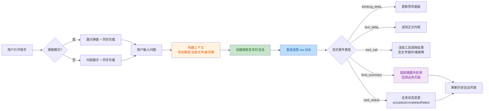

# 业务流程图

```mermaid
flowchart LR
    A[用户打开助手] --> B{弹窗模式?}
    B -->|是| C[展示弹窗 + 同步负载]
    B -->|否| D[内嵌展示 + 同步负载]
    C --> E[用户输入问题]
    D --> E
    E --> F[构建上下文<br/>项目路径/当前文件/身份等]
    F --> G[创建或恢复实时会话]
    G --> H[发送消息 via SSE]
    H --> I{流式事件类型}
    I -->|thinking_delta| J[更新思考面板]
    I -->|text_delta| K[追加正文内容]
    I -->|tool_call| L[渲染工具调用结果<br/>含文件操作/搜索等]
    I -->|final_summary| M[提取摘要并结束<br/>回调业务页面]
    I -->|task_status| N[任务状态变更<br/>accepted/completed/failed]
    M --> O[刷新历史会话列表]
    N --> O

    style F fill:#fff3e0,color:#e65100
    style G fill:#c8e6c9,color:#1a5e20
    style H fill:#bbdefb,color:#0d47a1
    style M fill:#f3e5f5,color:#7b1fa2
```
