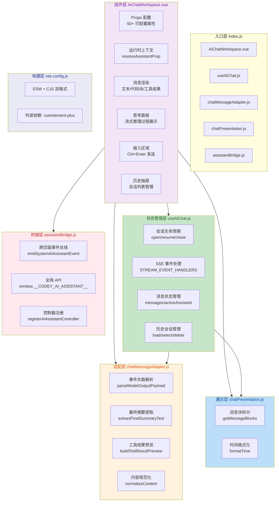

# 技术架构图

```mermaid
flowchart TB
    subgraph Entry["入口层 index.js"]
        A1[AiChatWorkspace.vue]
        A2[useAiChat.js]
        A3[chatMessageAdapter.js]
        A4[chatPresentation.js]
        A5[assistantBridge.js]
    end

    subgraph Component["组件层 AiChatWorkspace.vue"]
        B1[Props 配置<br/>50+ 可配置属性]
        B2[运行时上下文<br/>resolveAssistantProp]
        B3[消息渲染<br/>文本/代码块/工具结果]
        B4[思考面板<br/>流式推理过程展示]
        B5[输入区域<br/>Ctrl+Enter 发送]
        B6[历史抽屉<br/>会话列表管理]
    end

    subgraph Composable["状态管理层 useAiChat.js"]
        C1[会话生命周期<br/>open/resume/close]
        C2[SSE 事件处理<br/>STREAM_EVENT_HANDLERS]
        C3[消息状态管理<br/>messages/activeAssistant]
        C4[历史会话管理<br/>load/select/delete]
    end

    subgraph Adapter["适配层 chatMessageAdapter.js"]
        D1[事件负载解析<br/>parseModelOutputPayload]
        D2[最终摘要提取<br/>extractFinalSummaryText]
        D3[工具结果预览<br/>buildToolResultPreview]
        D4[内容规范化<br/>normalizeContent]
    end

    subgraph Presentation["展示层 chatPresentation.js"]
        E1[消息块拆分<br/>getMessageBlocks]
        E2[时间格式化<br/>formatTime]
    end

    subgraph Bridge["桥接层 assistantBridge.js"]
        F1[跨页面事件总线<br/>emitSystemAiAssistantEvent]
        F2[全局 API<br/>window.__CODEY_AI_ASSISTANT__]
        F3[控制器注册<br/>registerAiAssistantController]
    end

    subgraph Build["构建层 vite.config.js"]
        G1[ESM + CJS 双格式]
        G2[外部依赖: vue/element-plus]
    end

    Component --> Composable
    Component --> Adapter
    Component --> Presentation
    Component --> Bridge
    Composable --> Adapter
    Composable --> Presentation

    style Component fill:#f3e5f5,color:#7b1fa2
    style Composable fill:#c8e6c9,color:#1a5e20
    style Adapter fill:#fff3e0,color:#e65100
    style Presentation fill:#bbdefb,color:#0d47a1
    style Bridge fill:#ffebee,color:#c62828
    style Build fill:#e8eaf6,color:#283593
```
