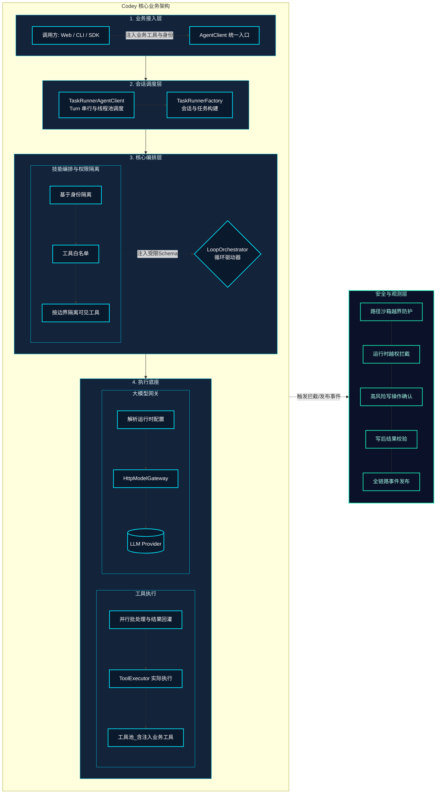

# 业务架构图（大模型调度 / 工具编排 / 技能编排 / 安全机制）

本文用于面向开源读者说明 Codey 的核心业务运行机制：如何把“大模型能力”组织成可执行的任务，并通过工具、技能与安全机制把能力落到真实工作区与业务场景中。

## 一次 Turn 的主流程

1. 调用方提交任务（goal / skillName / identities / modelConfig 等）到 `AgentClient`
2. 调度器对同一 `sessionId` 的 Turn 串行化，生成并启动任务
3. Loop 编排器驱动循环：组装 Prompt → 调用模型 → 解析 `tool_calls`
4. 工具编排器对工具调用做权限校验、并行批处理、执行与结果回灌
5. 触发安全链路：路径沙箱、写操作人工确认、写后校验与再规划
6. 事件流持续输出执行过程，供 UI/CLI 展示与审计

## 业务架构图

## 四个关注点的落点说明

### 1) 大模型调度

- 目标：保证同一会话的状态一致性与可追踪性，对 Turn 做串行调度，输出任务状态事件。
- 代码落点：
  - `TaskRunnerAgentClient`：`submitTurn()` 对同 `sessionId` 进行 Turn 串行化与线程池执行  
    - 源码：[`TaskRunnerAgentClient.java`](../codey-core/src/main/java/com/codey/task/TaskRunnerAgentClient.java)
  - `TaskRunnerFactory`：组装并创建 `TaskRunner`  
    - 源码：[`TaskRunnerFactory.java`](../codey-core/src/main/java/com/codey/task/TaskRunnerFactory.java)

### 2) 工具编排

- 目标：把模型输出的 `tool_calls` 变成可控、可并行、可审计的真实执行过程，并把结果回灌模型进入下一轮推理。
- 代码落点：
  - 工具调用处理：[`ToolCallProcessor.java`](../codey-core/src/main/java/com/codey/loop/ToolCallProcessor.java)
  - 工具执行器：[`ToolExecutor.java`](../codey-core/src/main/java/com/codey/tools/ToolExecutor.java)
  - 工具注册中心：[`ToolRegistry.java`](../codey-core/src/main/java/com/codey/tools/ToolRegistry.java)
  - 内置工具集（MCP）：[`BuiltinToolRegistryFactory.java`](../codey-core/src/main/java/com/codey/tools/BuiltinToolRegistryFactory.java)

### 3) 技能编排

- 目标：让业务系统以“技能”为单位组织 Prompt 与工具能力边界，并用 `identity` 控制可用范围。
- 代码落点：
  - 技能选择：[`SkillSelector.java`](../codey-core/src/main/java/com/codey/skill/SkillSelector.java)
  - 技能注册表：[`SkillRegistry.java`](../codey-core/src/main/java/com/codey/skill/SkillRegistry.java)
  - YAML 加载：[`YamlSkillLoader.java`](../codey-core/src/main/java/com/codey/skill/YamlSkillLoader.java)
  - 技能定义（约束字段）：[`SkillDefinition.java`](../codey-core/src/main/java/com/codey/skill/SkillDefinition.java)

### 4) 安全机制（工具、技能权限）

- 目标：减少模型误用工具与越界风险，把“允许什么工具/允许对什么路径操作/哪些操作需要审批/写完如何校验”收敛到可治理的链路里。
- 代码落点：
  - 工具权限校验：[`ToolAccessController.java`](../codey-core/src/main/java/com/codey/loop/ToolAccessController.java)
  - 工具暴露规划（只暴露允许的工具）：[`ToolExposurePlanner.java`](../codey-core/src/main/java/com/codey/loop/ToolExposurePlanner.java)
  - 工作区路径沙箱：[`WorkspacePathSupport.java`](../codey-core/src/main/java/com/codey/infra/WorkspacePathSupport.java)
  - 写操作人工确认：[`HumanConfirmationService.java`](../codey-core/src/main/java/com/codey/loop/HumanConfirmationService.java)
  - 写后校验与再规划：[`Verifier.java`](../codey-core/src/main/java/com/codey/verify/Verifier.java)
  - 注入过滤（伪工具包装）：[`FakeToolWrapperFilter.java`](../codey-core/src/main/java/com/codey/infra/FakeToolWrapperFilter.java)
