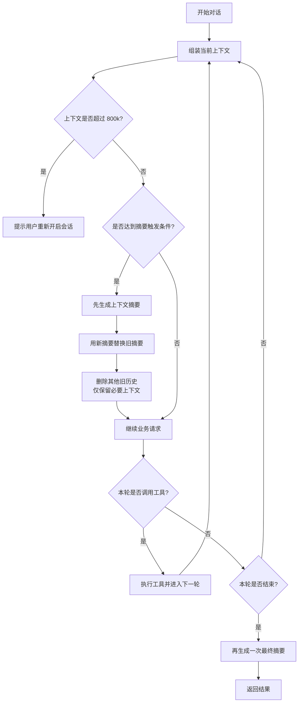

# 上下文摘要业务图

本文只说明“上下文摘要”这条业务链路，不展开代码实现细节。

## 业务图

## 业务规则

- 中途如果上下文变长了，先摘要再继续。
- 首次达到 `50k` 字符时生成摘要，之后每新增 `50k` 字符再生成一次。
- 本轮 loop 结束时，再额外生成一次最终摘要。
- 如果上下文达到 `800k`，不再继续执行，直接提示用户重新开启会话。
- 业务请求最终会同时带上摘要和最近必要上下文，不会只剩摘要。
